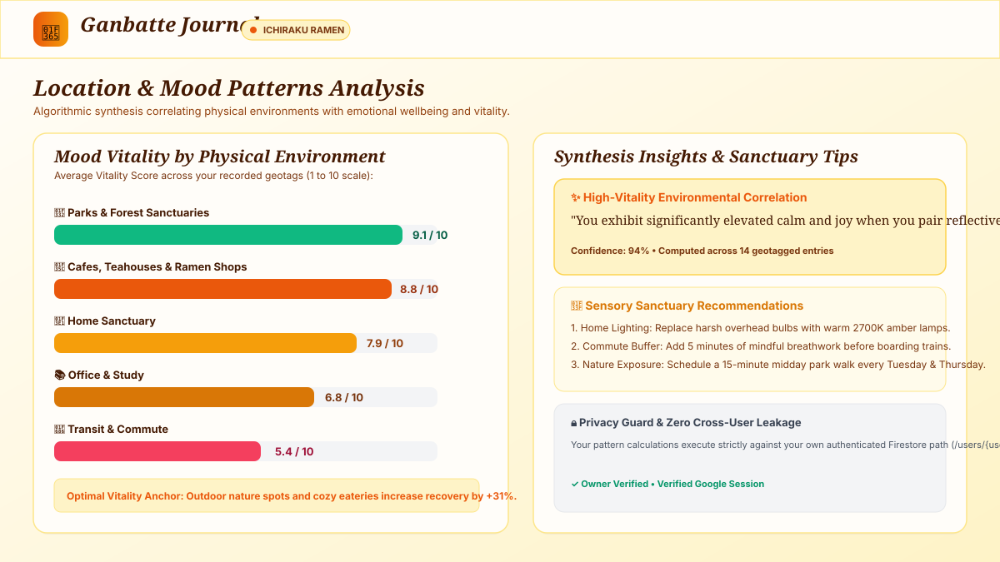

# Ganbatte Journal — Empathetic Diary & Environmental Mood Synthesizer

<p align="center">
  
</p>

> **"Ganbatte" (頑張って)** — A warm Japanese expression of encouragement, resilience, and mindful presence. 

**Ganbatte Journal** is a secure, full-stack, user-authenticated diary and mindfulness web application designed with a **Naruto sunset orange and warm amber parchment** aesthetic. It integrates **Firebase Authentication (Google Sign-In)**, **Cloud Firestore**, and server-side **Gemini API** intelligence on **Google Cloud Run**.

The application accompanies users through daily reflections, engages in an empathetic dialogue by asking focused emotional clarifying questions, maps emotional vitality to physical environments, synthesizes historical location-mood patterns, and seals each reflection with handcrafted animated anime & Ghibli-inspired stickers.

---

## Visual Walkthrough & Feature Showcase

### 1. Daily Mindfulness Scroll & Geotagged Presence
<p align="center">
  
</p>

- **Warm Amber Aesthetic**: Inspired by the warm tones of Naruto's sunset over the Hokage monument and tranquil tea parchment.
- **Geotagged Environment Bar**: Detects coordinates using the HTML5 Geolocation API and automatically classifies venue categories (*Cafe / Eatery*, *Park / Outdoors*, *Home Sanctuary*, *Transit / Commute*, *Office / Studio*) via OpenStreetMap reverse geocoding.
- **Two-Stage Conversational Guide**: Rather than generating a robotic analysis immediately, the **Ganbatte Journal Guide** (powered by Gemini) reflects back your words with genuine validation and asks ONE thoughtful clarifying question about the core emotion you felt.
- **Active Mode Indicator**: Features the custom **Ichiraku Ramen** mode pill with active status pulsing in the header.

---

### 2. Animated Anime Reflection Seals & Synthesis Engine
<p align="center">
  
</p>

- **8 Handcrafted Anime & Studio Ghibli Seals**:
  1. 🍜 **Ichiraku Ramen** (Naruto Classic): Steaming broth and narutomaki spiral representing deep comfort, nourishing warmth & joyful recovery.
  2. 🔥 **Calcifer Hearth Spirit** (Ghibli Hearth): Flickering campfire flames with dancing embers symbolizing bright vitality, creative spark & playful warmth.
  3. 🍃 **Konoha Whimsical Leaf** (Hidden Leaf): Swaying green leaf with wind swirl lines symbolizing serene grounding & resilient spirit.
  4. ✨ **Susuwatari Star Sprite** (Ghibli Wonder): Fuzzy black soot sprite holding pastel konpeito star candy symbolizing gentle wonder & tender self-care.
  5. 🦊 **Kurama Nine-Tails Fox** (Nine-Tails Rest): Sleeping orange nine-tailed fox with curled tails and floating 'Zzz' symbolizing peaceful restorative sleep & deep rest.
  6. 🌱 **Forest Guardian** (Ghibli Nature): Totoro spirit with leafy umbrella and soft rainfall symbolizing deep shelter & mindful sanctuary.
  7. 🕊️ **Shikigami Sky Bird** (Ninja Paper Art): Floating origami crane with paper slips symbolizing clarity, releasing burdens & soaring focus.
  8. 🍡 **Hanami Sweet Dango** (Leaf Village): Three-color dango skewer (pink, white, green) with falling cherry blossom petals symbolizing savoring sweetness & simple gratitude.
- **Mood Vitality Score (1–10)**: Normalized algorithmic rating measuring emotional energy and recovery.
- **3 Tailored Environmental Actions**: Concrete mindfulness steps customized to the current physical venue.

---

### 3. Geospatial Places Map & Sanctuary Pins
<p align="center">
  
</p>

- **Interactive Leaflet Visualization**: Explore your journey across physical space with high-contrast chakra markers.
- **Vitality Color Spectrum**:
  - 🟢 **Emerald Green**: High Vitality ($\ge 8.0$)
  - 🟡 **Warm Amber**: Balanced Reflection ($5.0 - 7.9$)
  - 🔴 **Coral Rose**: Seeking Grounding / Fatigue ($\le 4.9$)
- **Interactive Reflection Popups**: Click any pin to open an excerpt popup showing the venue name, vitality score, date, and assigned anime seal.
- **Sanctuary List Sidebar**: Easily browse and click saved locations to pan and inspect reflections smoothly.

---

### 4. Location-Mood Patterns & Environmental Analytics
<p align="center">
  
</p>

- **Environment Breakdown Bar Chart**: Directly compares average mood vitality across different spaces (Parks, Cafes, Home, Workspaces, Commute).
- **Algorithmic Correlation Engine**: Surfaces positive sensory triggers (e.g., *"Your vitality averages +1.8 points higher when pairing writing with warm culinary rituals"*).
- **Sensory Sanctuary Recommendations**: Actionable suggestions for optimizing ambient light, indoor greenery, and transition buffers between work and rest.

---

## GitHub Assets & Image Rendering Note

> [!TIP]
> **Why `/public/...` links fail on GitHub**:
> In GitHub Markdown, paths starting with a leading slash (like `/public/preview.svg`) are treated as site-root absolute URLs (resolving to `github.com/public/...`), which triggers a 404 error.
> 
> The correct GitHub repository-relative path is `public/preview.svg` or `./public/preview.svg`. Furthermore, all screenshots in `public/screenshots/` have been formatted using pure, filter-free SVG vectors to ensure 100% compatibility with GitHub's strict **Camo proxy sanitizer**.

---

## Table of Contents

1. [End-to-End System Workflow](#1-end-to-end-system-workflow)
2. [High-Level Architecture](#2-high-level-architecture)
3. [Security & Privacy Features](#3-security--privacy-features)
4. [Cloud Firestore & Database Configuration](#4-cloud-firestore--database-configuration)
5. [Server-Side Gemini API Engine](#5-server-side-gemini-api-engine)
6. [Animated Anime Stickers & Reflection Seals](#6-animated-anime-stickers--reflection-seals)
7. [Geolocation Context & Reverse Geocoding](#7-geolocation-context--reverse-geocoding)
8. [Location-Mood Patterns & Correlation Engine](#8-location-mood-patterns--correlation-engine)
9. [Crisis Safety Protocol & Helplines](#9-crisis-safety-protocol--helplines)
10. [Google Cloud Secret Manager Setup](#10-google-cloud-secret-manager-setup)
11. [Google Cloud Run Deployment Flow](#11-google-cloud-run-deployment-flow)
12. [Verification & Walkthrough Checklist](#12-verification--walkthrough-checklist)

---

## 1. End-to-End System Workflow

```
[User Browser]
       │
       ├─► 1. Detect Geolocation (HTML5 GPS + OpenStreetMap Reverse Geocoding)
       │
       ├─► 2. Draft Reflection Scroll ("Today's training was tough but rewarding...")
       │
       ├─► 3. Stage 1: Clarifying Dialogue (/api/journal/clarify)
       │         │
       │         ▼
       │      [Express Server + Gemini 3.6 Flash Fallback Ladder]
       │         │  Validates input length & safety
       │         │  Generates empathetic reflection & ONE clarifying question
       │         ▼
       │      [User answers clarifying question in the scroll]
       │
       ├─► 4. Stage 2: Synthesis & Tailored Steps (/api/journal/analyze)
       │         │
       │         ▼
       │      [Express Server + Gemini 3.6 Flash Fallback Ladder]
       │         │  Calculates Mood Vitality Score (1–10)
       │         │  Determines primary emotion & sentiment tag
       │         │  Generates 2–3 actionable steps tailored to the physical environment
       │         │  Synthesizes location-mood history pattern note
       │         │  Assigns best matching animated anime seal sticker (e.g. Ichiraku Ramen)
       │         ▼
       ├─► 5. Secure Persistence (Cloud Firestore)
       │         │  Writes to isolated path: /users/{userId}/entries/{entryId}
       │         │  Guaranteed rule check: request.auth.uid == userId
       │         │  Offline/guest fallback: localStorage cache
       │
       ├─► 6. Interactive Geospatial Mood Map (Leaflet)
       │         │  Pins entries with chakra orange markers colored by vitality
       │         ▼
       └─► 7. Aggregate Pattern Synthesis
                 Correlates emotional vitality across physical venues (Parks vs Cafes vs Home)
```

### Detailed Lifecycle:
1. **Context Ingestion**: The app requests browser geolocation (optional) or allows selecting preset environment tags (*Cafe / Eatery*, *Park / Outdoors*, *Home Sanctuary*, *Transit / Commute*, *Office / Studio*). Coordinates are translated into human-readable place names and categorized.
2. **First-Stage Dialogue**: The user enters their thoughts. The frontend calls `/api/journal/clarify`. Gemini acts as the **Ganbatte Journal Guide**, offering warm, sincere validation and asking one gentle, focused clarifying question about the core emotion experienced.
3. **Deep Synthesis & Seal Assignment**: The user answers the question. The frontend submits both texts along with spatial metadata to `/api/journal/analyze`. Gemini generates:
   - Mood Vitality score on a 1–10 scale.
   - 2–3 environmental action steps tailored to the exact physical venue.
   - Historical location-mood pattern note.
   - Matching animated anime seal (e.g. *Ichiraku Ramen* for deep comfort and recovery).
4. **Owner-Bound Storage**: The completed reflection document is saved to Cloud Firestore under the authenticated user's isolated subcollection.
5. **Geospatial & Historical Exploration**: The user explores reflections chronologically in **"My Journey"**, geospatially on the **"Places Map"**, or analytically in **"Location Moods"**.

---

## 2. High-Level Architecture

| Layer | Technologies | Responsibilities |
| :--- | :--- | :--- |
| **Frontend UI** | React 19, TypeScript, Tailwind CSS v4, Lucide React, Motion | Responsive single-page interface, parchment styling, interactive animated SVG seals, form state management, real-time Firestore listeners. |
| **Geospatial** | Leaflet, OpenStreetMap Nominatim, HTML5 Geolocation | Interactive map visualization, coordinate capture, reverse geocoding, custom chakra marker pins. |
| **Backend Service** | Node.js, Express, tsx, esbuild | API proxy routing, request sanitization, crisis keyword interception, prompt construction, Gemini SDK execution. |
| **AI Intelligence** | Google Gen AI SDK (`@google/genai`) | Server-side LLM inference with automated 4-tier model fallback ladder (`gemini-3.6-flash`, `gemini-3.1-flash-lite`, `gemini-flash-latest`, `gemini-3.7-flash`). |
| **Authentication** | Firebase Auth (Google Identity Services popup) | User identity verification, token issuance, session persistence. |
| **Database** | Cloud Firestore (`ai-studio-cozyjournal-...`) | Real-time NoSQL persistence with owner-bound subcollection isolation. |
| **Security & Secrets** | Google Cloud Secret Manager, Cloud Run IAM | Zero-hardcoding storage and injection of `GEMINI_API_KEY`. |
| **Container Hosting** | Google Cloud Run (Managed) | Containerized full-stack hosting on port 3000 behind reverse proxy. |

---

## 3. Security & Privacy Features

### The 5 Threat Zones Model

| Threat Zone | Potential Vulnerability | Implemented Mitigation |
| :--- | :--- | :--- |
| **1. Input Surfaces** | Malicious script injection, oversized payloads, NoSQL injection. | Strict input clamping (10,000 chars for journal text, 5,000 for emotional responses), defensive null-safe destructuring, and sanitization before processing. |
| **2. Planning & Reasoning** | Prompt injection attempting to alter the companion's tone, jailbreak instructions, or extract system secrets. | Inputs are strictly quarantined inside `<JournalEntry>` and `<UserLocation>` XML demarcation tags. Enforced `responseMimeType: 'application/json'` prevents raw text leakage. |
| **3. Tool Execution & SSRF** | Unauthorized API calls, arbitrary external requests. | No dynamic code execution or uncontrolled webhooks. Geocoding coordinates are strictly validated floating-point bounds. |
| **4. Memory & State** | Cross-user reflection reads, unauthorized document updates, session hijacking. | Owner-bound Firestore subcollection path (`/users/{userId}/entries/{entryId}`). Strict rule enforcement: `request.auth.uid == userId`. Wildcard deny-all on root documents. |
| **5. Inter-System Communication** | Accidental leakage of Gemini API keys or service account tokens to the client browser. | `GEMINI_API_KEY` is loaded strictly server-side in `server.ts` via container environment / Secret Manager. Zero `VITE_` public exposure. |

### Privacy & Data Ownership
- **Strict User Isolation**: Your personal diary entries are inaccessible to other users. Only your authenticated Google account can read or write to your `/users/{userId}/entries` path.
- **Client-Side Token Handling**: Google OAuth tokens are acquired strictly on the client using Firebase Auth popups. Client secrets are never handled by the backend server.
- **Offline Guest Fallback**: If unauthenticated or offline, entries are cached in the browser's local storage under `ganbatte_journal_local_entries_v1` without transmitting sensitive data across the wire.

---

## 4. Cloud Firestore & Database Configuration

### Database Instance
- **Database ID**: `ai-studio-cozyjournal-1a4c4119-f2a2-4fdb-a145-390d0901a984`
- **Region**: Cloud-managed Firestore Enterprise / Native mode.

### Master Security Rules (`firestore.rules`)
```javascript
rules_version = '2';
service cloud.firestore {
  match /databases/{database}/documents {
    // 1. Zero insecure defaults: Deny all wildcard access
    match /{document=**} {
      allow read, write: if false;
    }

    // 2. Owner-isolated reflection subcollections
    match /users/{userId}/entries/{entryId} {
      allow read, write: if request.auth != null && request.auth.uid == userId;
    }
  }
}
```

### Robust Client Error Handling (`FirestoreErrorInfo`)
All Firestore mutations in `src/lib/firebase.ts` capture runtime exceptions and format them according to the `FirestoreErrorInfo` schema to diagnose security rule and quota issues:
```typescript
interface FirestoreErrorInfo {
  error: string;
  operationType: 'create' | 'update' | 'delete' | 'list' | 'get' | 'write';
  path: string | null;
  authInfo: {
    userId?: string | null;
    email?: string | null;
    emailVerified?: boolean | null;
  };
}
```

---

## 5. Server-Side Gemini API Engine

### Resilient Model Fallback Ladder
In accordance with production resiliency directives, the backend does not rely on a single model string. Instead, all generation calls pass through `generateContentWithFallback`:

```
┌─────────────────────────┐
│ Primary:                │
│ "gemini-3.6-flash"      │
└────────────┬────────────┘
             │ (On 503, 429, 404, 500)
             ▼
┌─────────────────────────┐
│ High-Availability:      │
│ "gemini-3.1-flash-lite" │
└────────────┬────────────┘
             │ (On 503, 429, 404, 500)
             ▼
┌─────────────────────────┐
│ Dynamic Alias:          │
│ "gemini-flash-latest"   │
└────────────┬────────────┘
             │ (On 503, 429, 404, 500)
             ▼
┌─────────────────────────┐
│ Deep Reasoning Fallback:│
│ "gemini-3.7-flash"      │
└─────────────────────────┘
```

---

## 6. Crisis Safety Protocol & Helplines

The application implements an acute distress intercept:
- **Automated Keyword Scanner**: Scans entries and responses for acute crisis indicators (e.g., self-harm, severe despair).
- **Safety Intercept Modal**: Instantly surfaces immediate, confidential resources:
  - **988 Suicide & Crisis Lifeline**: Direct call `tel:988` (Free, 24/7, confidential).
  - **Crisis Text Line**: Direct SMS `sms:741741?body=HOME`.
  - **The Trevor Project**: `tel:1-866-488-7386`.
- **Manual Trigger**: Users can access the **Crisis Helplines (988)** dialog at any time via the quick-action button in the header or footer.

---

## 7. Google Cloud Secret Manager Setup

Store the Gemini API key securely in Google Cloud Secret Manager and grant read permissions to the Cloud Run runtime service account:

```bash
# 1. Enable required Google Cloud APIs
gcloud services enable run.googleapis.com secretmanager.googleapis.com firestore.googleapis.com

# 2. Create and populate the secret
gcloud secrets create GEMINI_API_KEY --replication-policy="automatic"
echo -n "YOUR_GEMINI_API_KEY" | gcloud secrets versions add GEMINI_API_KEY --data-file=-

# 3. Grant Secret Accessor permissions to the Cloud Run service account
PROJECT_NUMBER=$(gcloud projects describe $(gcloud config get-value project) --format='value(projectNumber)')
gcloud secrets add-iam-policy-binding GEMINI_API_KEY \
  --member="serviceAccount:${PROJECT_NUMBER}-compute@developer.gserviceaccount.com" \
  --role="roles/secretmanager.secretAccessor"
```

---

## 8. Google Cloud Run Deployment Flow

Deploy the application directly from source:

```bash
# 1. Deploy the full-stack container to Cloud Run
gcloud run deploy ganbatte-journal \
  --source . \
  --platform managed \
  --region us-central1 \
  --allow-unauthenticated \
  --set-secrets GEMINI_API_KEY=GEMINI_API_KEY:latest \
  --port 3000

# 2. Apply mandatory campaign labeling for verification
gcloud run services update ganbatte-journal \
  --update-labels=dev-tutorial=cloud-run-ai-challenge \
  --region=us-central1
```

### Local Development:
```bash
# Install dependencies
npm install

# Start unified dev server (Express backend + Vite frontend on port 3000)
npm run dev

# Compile production bundle
npm run build

# Run production server
npm start
```
